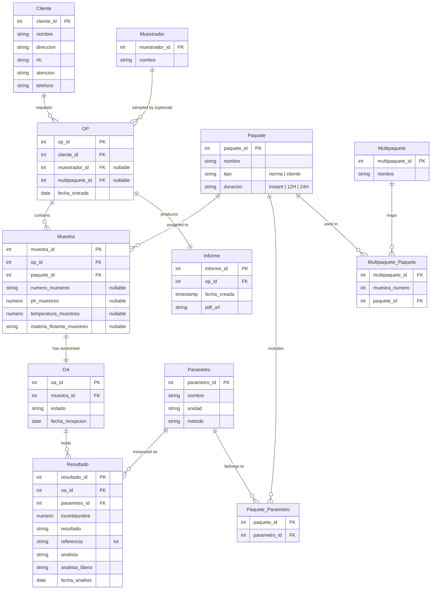

# Database Schema — Laboratory Analysis System

**Purpose of this document:** a clear, implementation-ready description of the database schema for the water-analysis laboratory system, written to be handed to a coding agent for implementation. Domain terms are kept in Spanish (the lab's working vocabulary); explanatory prose is in English.

> Target database: **PostgreSQL** (adjust types if you use something else). All table/column names below are the canonical names — the UI never shows raw IDs or link tables to users; those exist only so the system can connect records without duplicating data.

---

## 1. Domain overview

The lab receives water samples (mostly wastewater / treated wastewater), analyzes them for a set of parameters, and issues a formal report to the client. The workflow, in order:

1. A **client** (`Cliente`) requests analysis.
2. Each intake is registered as an **OP** — one OP corresponds to exactly **one chain of custody** and produces exactly **one report**. The OP records who the client is and (if the lab did the sampling) which sampler took it.
3. An OP contains one or more **muestras** (samples). ~80% of intakes are a single sample; ~20% (e.g. Kellogg's) bring multiple samples under one OP.
4. Each **muestra** is assigned an analysis **paquete** (package) — a named set of parameters. The package determines which parameters must be measured.
5. Each **muestra** has one **Orden de Análisis (OA)** — the analyst's worksheet. The analyst fills in a **resultado** row per parameter (value, uncertainty, lot reference, who analyzed, who released, date).
6. Once every result on the OP is filled, an **Informe** (report) can be generated and stored.

### Two hard rules from the domain

- **Confidentiality:** analysts must **not** see client information. The OA / results view must expose sample + parameters only, never the linked `Cliente` data. (Design implication: enforce at the view/permission layer, not by duplicating data.)
- **Audit gating:** a report cannot be generated until **all** result fields for the OP are complete. Report generation stamps the creation date automatically.

---

## 2. Glossary of core concepts

| Term | Meaning |
|---|---|
| **OP** | The master registration record. One OP = one chain of custody = one report. Acts as the intake counter. |
| **Muestra** | A physical sample. Belongs to one OP. Has its own sample number and its own OA. |
| **Número de muestreo** | Present **only if the lab performed the sampling**. Its presence/absence drives whether field parameters (pH, temperature, floating matter) were captured by us at reception vs. left for the analyst. |
| **OA (Orden de Análisis)** | The analyst worksheet for one muestra. Lists the parameters to report and holds their result rows. |
| **Resultado** | One measured parameter on an OA (value, uncertainty, lot, analyst, releaser, date). |
| **Parámetro** | A measurable quantity (pH, coliformes fecales, E. coli…). Always tied to **one** unit and **one** method. |
| **Método** | The "recipe" / mini-norm for measuring a parameter (e.g. `008` for pH, `042` for microbiology). Stored as a plain attribute of the parameter — the lab only needs the method **name** for the report, not its contents. |
| **Paquete de análisis** | A named set of parameters (replaces the older "norma" concept). Can be a regulatory norm (`Norma001`, 12H) or a client-specific package (`Kansas City`, `Entrada/Salida`, `Reactor`). |
| **Multipaquete** | A grouping used when one OP has several samples, each needing a different package (e.g. `kellogs-cereales`: sample 1 → Entrada/Salida, sample 2 → Reactor, …). |
| **Duración** | Sampling regime of a package: `instant` (1 subsample), `12H` (4 subsamples), `24H` (6 subsamples). |
| **Informe** | The generated client-facing report. A **derived** record — it references data across tables rather than duplicating it. |

---

## 3. Entity-relationship diagram



---

## 4. Table-by-table specification

### 4.1 `Cliente`
Master client list. Feeds a dropdown when registering an OP and supplies the header block of the final report.

| Column | Type | Notes |
|---|---|---|
| `cliente_id` | serial | **PK** |
| `nombre` | text | e.g. "Grupo Industrial Nexus, Apodaca" — note distinct branches are distinct rows |
| `direccion` | text | |
| `rfc` | text | |
| `atencion` | text | contact person |
| `telefono` | text | |

### 4.2 `Muestrador`
The lab's samplers. Purely referenced by `OP` when the lab did the sampling.

| Column | Type | Notes |
|---|---|---|
| `muestrador_id` | serial | **PK** |
| `nombre` | text | |

### 4.3 `OP`
The master intake record. **One OP = one chain of custody = one report.**

| Column | Type | Notes |
|---|---|---|
| `op_id` | serial | **PK** (e.g. `001`) |
| `cliente_id` | int | **FK → Cliente** |
| `muestrador_id` | int | **FK → Muestrador**, nullable — set only if the lab did the sampling |
| `multipaquete_id` | int | **FK → Multipaquete**, nullable — set when a multi-sample package (e.g. Kellogg's) is applied |
| `fecha_entrada` | date | reception date |

> Optional future columns mentioned in the meeting: `cotizacion` (quote), `numero_control`.

### 4.4 `Muestra`
A physical sample under an OP. Modeled as a one-to-many from `OP` (an `op_id` FK on the sample), **not** a junction table — a sample belongs to exactly one OP.

| Column | Type | Notes |
|---|---|---|
| `muestra_id` | serial | **PK** — this is the "número de muestra"; it also serves as the OA identifier |
| `op_id` | int | **FK → OP** |
| `paquete_id` | int | **FK → Paquete** — the package assigned to this sample |
| `numero_muestreo` | text | **nullable.** Presence ⇒ the lab sampled it ⇒ field params below apply and report shows "pH muestreo". Absence ⇒ analyst must measure pH; report shows plain "pH". |
| `ph_muestreo` | numeric | nullable — captured at reception if the lab sampled |
| `temperatura_muestreo` | numeric | nullable — field temperature |
| `materia_flotante_muestreo` | text | nullable — floating matter (field observation) |

> **UI behavior:** a checkbox "¿Lo muestreamos nosotros?" enables the `numero_muestreo` + field-parameter inputs. The *existence* of a `numero_muestreo` value is the source of truth that the lab did the sampling.

### 4.5 `OA` (Orden de Análisis)
The analyst worksheet — exactly one per muestra.

| Column | Type | Notes |
|---|---|---|
| `oa_id` | serial | **PK** (may reuse `muestra_id`) |
| `muestra_id` | int | **FK → Muestra**, unique (1:1) |
| `estado` | enum | `pendiente` \| `completa` \| `liberada` |
| `fecha_recepcion` | date | |

### 4.6 `Resultado`
One row per parameter on an OA. The analyst fills these in. Rows are **pre-created** (empty) when the sample's package is applied, so the analyst just fills values.

| Column | Type | Notes |
|---|---|---|
| `resultado_id` | serial | **PK** |
| `oa_id` | int | **FK → OA** |
| `parametro_id` | int | **FK → Parametro** |
| `incertidumbre` | numeric | reported by analyst |
| `resultado` | text | the measured value (text to allow "<0.5", "N/A", etc.) |
| `referencia` | text | lot ("lote") reference |
| `analista` | text | who performed the analysis |
| `analista_libera` | text | who reviewed/released the result |
| `fecha_analisis` | date | |

### 4.7 `Parametro`
The catalog of measurable quantities. Each parameter is permanently tied to one unit and one method, so the report engine can look up name + unit + method by parameter.

| Column | Type | Notes |
|---|---|---|
| `parametro_id` | serial | **PK** |
| `nombre` | text | full name for the report (e.g. "Potencial de Hidrógeno") |
| `unidad` | text | e.g. `U de pH`, `NMP` |
| `metodo` | text | method / mini-norm name, e.g. `008`, `042`, `cálculo` |

> **Why method is just a column:** the lab only needs the method **name** on the report, not its procedural contents. A single method (e.g. `042`) can yield several parameters (fecales, E. coli, totales) — that's fine, because **packages link to parameters, not to methods**, so a package can include a subset (e.g. only fecales + E. coli). Some parameters use a `cálculo` method (e.g. Nitrógeno Total = TKN + nitratos + nitritos) — represented simply as `metodo = 'cálculo'`.

### 4.8 `Paquete` (Paquete de Análisis)
A named, reusable set of parameters. Replaces the older "norma" table. Types: regulatory norms and client-specific packages coexist in the same table.

| Column | Type | Notes |
|---|---|---|
| `paquete_id` | serial | **PK** |
| `nombre` | text | e.g. `Norma001`, `Kansas City`, `Entrada/Salida`, `Reactor` |
| `tipo` | enum | `norma` \| `cliente` |
| `duracion` | enum | `instant` (1 subsample) \| `12H` (4 subsamples) \| `24H` (6 subsamples) |

> **Duración as a column (not baked into the name):** the same norm exists at different durations (Norma001 @ 12H, Norma001 @ 24H…) and durations are shared across norms. Keeping it as its own column lets you query "all 12H packages regardless of norm." Each `(norm, duración)` combination is its own `Paquete` row with its own parameter links.

### 4.9 `Paquete_Parametro` (link table)
Many-to-many between packages and parameters. **Not shown to users** — it exists so the system knows which parameters a package requires.

| Column | Type | Notes |
|---|---|---|
| `paquete_id` | int | **FK → Paquete** |
| `parametro_id` | int | **FK → Parametro** |

> Composite PK `(paquete_id, parametro_id)`. When a sample is assigned a package, the system reads this table to know which `Resultado` rows to create.

### 4.10 `Multipaquete`
A grouping for OPs that carry multiple samples, each needing a different package (e.g. Kellogg's cereales / snack). Selecting a multipaquete auto-populates the OP's samples and their packages.

| Column | Type | Notes |
|---|---|---|
| `multipaquete_id` | serial | **PK** |
| `nombre` | text | e.g. `kellogs-cereales`, `kellogs-snack` |

### 4.11 `Multipaquete_Paquete` (link table)
Maps each sample position within a multipaquete to a package. **Not shown to users.**

| Column | Type | Notes |
|---|---|---|
| `multipaquete_id` | int | **FK → Multipaquete** |
| `muestra_numero` | int | sample position (1..N) within the multipaquete |
| `paquete_id` | int | **FK → Paquete** — the package for that sample position |

> Example `kellogs-cereales` (5 samples): 1 → `Entrada/Salida`, 2 → `Reactor`, 3 → `Reactor`, 4 → `Entrada/Salida`, 5 → `Entrada/Salida`. Each of those packages links to its own parameters via `Paquete_Parametro`.

### 4.12 `Informe`
The generated report record. **Derived** — it references the OP and pulls display data from the underlying tables; it does not duplicate them.

| Column | Type | Notes |
|---|---|---|
| `informe_id` | serial | **PK** |
| `op_id` | int | **FK → OP**, unique (one report per OP) |
| `fecha_creada` | timestamp | set automatically when "Exportar informe" is clicked |
| `pdf_url` | text | link to the generated PDF |

---

## 5. Key relationships (cardinality)

- `Cliente` **1 — N** `OP`
- `Muestrador` **1 — N** `OP` (optional; only when the lab sampled)
- `OP` **1 — N** `Muestra`
- `OP` **1 — 1** `Informe`
- `OP` **N — 1** `Multipaquete` (optional)
- `Muestra` **N — 1** `Paquete`
- `Muestra` **1 — 1** `OA`
- `OA` **1 — N** `Resultado`
- `Parametro` **1 — N** `Resultado`
- `Paquete` **N — N** `Parametro` (via `Paquete_Parametro`)
- `Multipaquete` **N — N** `Paquete` (via `Multipaquete_Paquete`, keyed by sample position)

---

## 6. Business rules & implementation notes

1. **`numero_muestreo` is the sampling flag.** Do not add a separate boolean; the presence of a value means the lab performed the sampling. Report labels switch between "pH muestreo" (we sampled) and "pH" (analyst must measure).
2. **Result rows are generated from the package.** When a sample gets a `paquete_id` (directly or via a multipaquete), create one empty `Resultado` per linked parameter. Analysts only fill values, never create rows.
3. **Report gating (audit).** Block `Informe` creation until every `Resultado` for the OP has its required fields filled. On success, stamp `fecha_creada` automatically. If incomplete, surface "orden de análisis incompleta, revisar."
4. **No duplicated data — use references.** The `Informe` and any reception dashboard are computed views over the base tables (join `OP` → `Cliente`, `Muestra` → `Paquete` → parameters, `OA` → `Resultado`, etc.). Never copy a value into two places; the worst failure mode is one copy changing and the other not.
5. **Report content is a "puzzle."** Each report line = static columns from `Parametro` (name, unit, method) + dynamic columns from `Resultado` (value, analyst, date). The engine assembles both halves per parameter.
6. **Analyst confidentiality.** The OA/results screens must never expose `Cliente`. Enforce with a restricted view or role-based access.
7. **Packages are user-creatable.** Reception staff can define a new client package: name it, set duración, pick parameters — the system writes the `Paquete` row and the `Paquete_Parametro` links behind the scenes. Same for multipaquetes.
8. **Method contents are intentionally not stored.** Only the method **name** is kept (on `Parametro`). This was a deliberate decision to avoid building structure that isn't needed yet.

### Suggested future addition (not yet in scope)
- **Soft delete / papelera for OPs.** A "deleted" archive table (or an `estado`/`deleted_at` column on `OP`) so cancelled or mis-entered OPs can be moved out of the active list, kept for proof, restored on error, or purged to free space. Mentioned in the meeting as a wanted feature.
- **Subsample-level results.** Certain parameters (grasas y aceites, microbiology/coliformes) are reported per subsample rather than on the composite sample. Not modeled yet; if needed later, add a `subtoma` dimension to `Resultado`.

---

## 7. PostgreSQL DDL (starter)

```sql
-- Enums
CREATE TYPE oa_estado    AS ENUM ('pendiente', 'completa', 'liberada');
CREATE TYPE paquete_tipo AS ENUM ('norma', 'cliente');
CREATE TYPE duracion     AS ENUM ('instant', '12H', '24H');

CREATE TABLE cliente (
    cliente_id  SERIAL PRIMARY KEY,
    nombre      TEXT NOT NULL,
    direccion   TEXT,
    rfc         TEXT,
    atencion    TEXT,
    telefono    TEXT
);

CREATE TABLE muestrador (
    muestrador_id SERIAL PRIMARY KEY,
    nombre        TEXT NOT NULL
);

CREATE TABLE parametro (
    parametro_id SERIAL PRIMARY KEY,
    nombre       TEXT NOT NULL,
    unidad       TEXT NOT NULL,
    metodo       TEXT NOT NULL
);

CREATE TABLE paquete (
    paquete_id SERIAL PRIMARY KEY,
    nombre     TEXT NOT NULL,
    tipo       paquete_tipo NOT NULL,
    duracion   duracion
);

CREATE TABLE paquete_parametro (
    paquete_id   INT NOT NULL REFERENCES paquete(paquete_id) ON DELETE CASCADE,
    parametro_id INT NOT NULL REFERENCES parametro(parametro_id),
    PRIMARY KEY (paquete_id, parametro_id)
);

CREATE TABLE multipaquete (
    multipaquete_id SERIAL PRIMARY KEY,
    nombre          TEXT NOT NULL
);

CREATE TABLE multipaquete_paquete (
    multipaquete_id INT NOT NULL REFERENCES multipaquete(multipaquete_id) ON DELETE CASCADE,
    muestra_numero  INT NOT NULL,
    paquete_id      INT NOT NULL REFERENCES paquete(paquete_id),
    PRIMARY KEY (multipaquete_id, muestra_numero)
);

CREATE TABLE op (
    op_id           SERIAL PRIMARY KEY,
    cliente_id      INT NOT NULL REFERENCES cliente(cliente_id),
    muestrador_id   INT REFERENCES muestrador(muestrador_id),
    multipaquete_id INT REFERENCES multipaquete(multipaquete_id),
    fecha_entrada   DATE NOT NULL DEFAULT CURRENT_DATE
);

CREATE TABLE muestra (
    muestra_id                SERIAL PRIMARY KEY,
    op_id                     INT NOT NULL REFERENCES op(op_id) ON DELETE CASCADE,
    paquete_id                INT NOT NULL REFERENCES paquete(paquete_id),
    numero_muestreo           TEXT,            -- NULL ⇒ client brought the sample
    ph_muestreo               NUMERIC,
    temperatura_muestreo      NUMERIC,
    materia_flotante_muestreo TEXT
);

CREATE TABLE oa (
    oa_id           SERIAL PRIMARY KEY,
    muestra_id      INT NOT NULL UNIQUE REFERENCES muestra(muestra_id) ON DELETE CASCADE,
    estado          oa_estado NOT NULL DEFAULT 'pendiente',
    fecha_recepcion DATE NOT NULL DEFAULT CURRENT_DATE
);

CREATE TABLE resultado (
    resultado_id    SERIAL PRIMARY KEY,
    oa_id           INT NOT NULL REFERENCES oa(oa_id) ON DELETE CASCADE,
    parametro_id    INT NOT NULL REFERENCES parametro(parametro_id),
    incertidumbre   NUMERIC,
    resultado       TEXT,          -- text: allows "<0.5", "N/A"
    referencia      TEXT,          -- lote
    analista        TEXT,
    analista_libera TEXT,
    fecha_analisis  DATE,
    UNIQUE (oa_id, parametro_id)
);

CREATE TABLE informe (
    informe_id   SERIAL PRIMARY KEY,
    op_id        INT NOT NULL UNIQUE REFERENCES op(op_id),
    fecha_creada TIMESTAMPTZ NOT NULL DEFAULT now(),
    pdf_url      TEXT
);
```

---

## 8. Worked example — Kellogg's cereales

1. Reception registers an **OP** for client Kellogg's, selecting multipaquete **`kellogs-cereales`**.
2. The system reads `multipaquete_paquete` and creates **5 muestras** under that OP, assigning each its package:
   - muestra 1 → `Entrada/Salida`, 2 → `Reactor`, 3 → `Reactor`, 4 → `Entrada/Salida`, 5 → `Entrada/Salida`.
   - `numero_muestreo` is NULL on all (client brought the samples).
3. For each muestra, an **OA** is created, and empty **Resultado** rows are generated from each package's `paquete_parametro` links (`Entrada/Salida` → a,b,c,d,e; `Reactor` → a,b,c).
4. Analysts fill in results per OA.
5. When all results across the OP are complete, reception generates the **Informe**, which pulls parameter names/units/methods from `parametro` and values from `resultado`, and stores the PDF.
